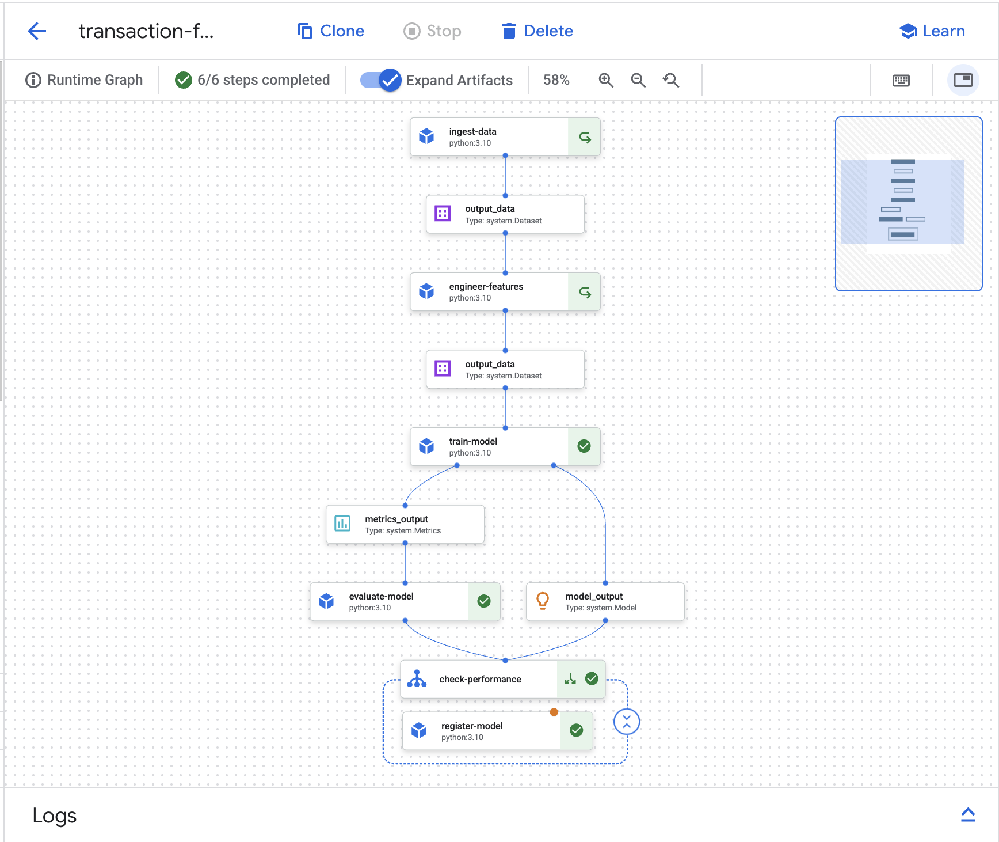
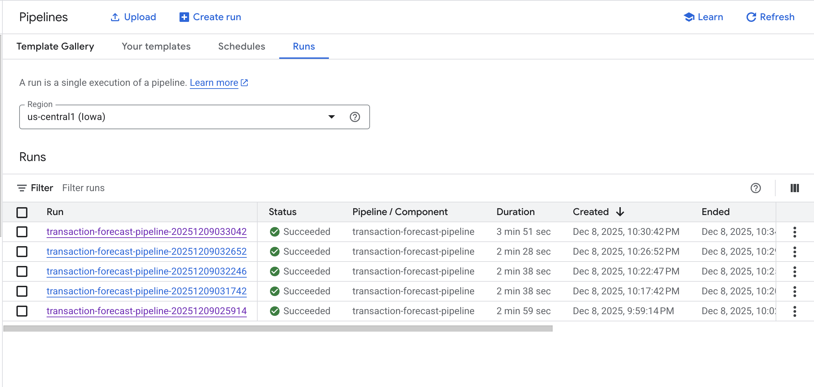
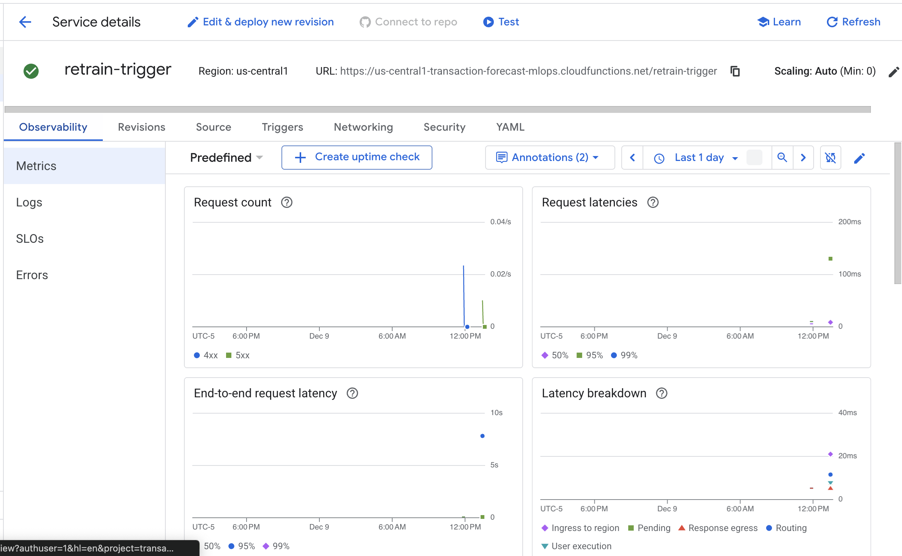
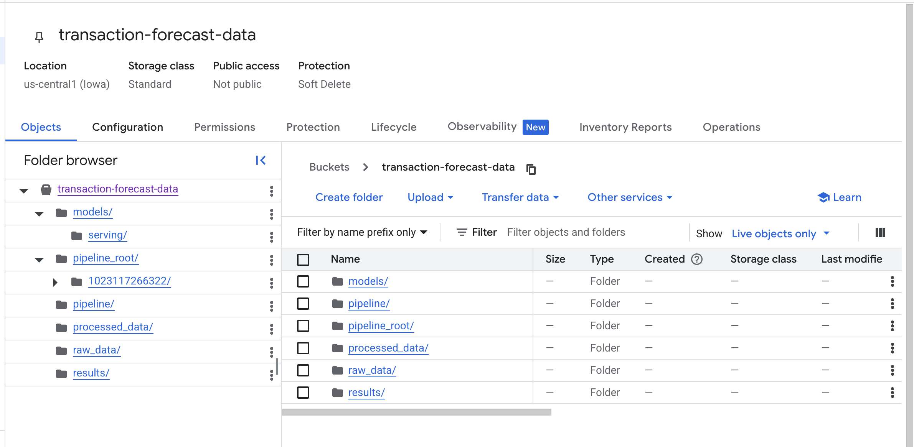

# Transaction Volume Forecasting - MLOps Pipeline

[](https://transaction-forecast-mlops-demo.streamlit.app)

**[Live Demo](https://transaction-forecast-mlops-demo.streamlit.app)** | End-to-end MLOps system for forecasting e-commerce transaction volumes

---

## The Problem

Fintech and e-commerce companies struggle to predict daily transaction volumes accurately. Poor forecasting leads to:
- **Infrastructure over-provisioning** → wasted cloud costs
- **Under-provisioning** → service degradation during demand spikes
- **Manual forecasting** → doesn't capture complex seasonality and trends

## The Solution

Built and benchmarked three distinct forecasting approaches against 2 years of Brazilian e-commerce transaction data (99,441 orders → 610 daily volumes). Implemented a production MLOps pipeline with automated retraining, champion/challenger model evaluation, and drift monitoring.

---

## Results

| Model | MAPE | Latency | Status |
|-------|------|---------|--------|
| **XGBoost** | **6.41%** | **0.5ms** | ✅ Champion |
| Prophet | 9.77% | 196ms | Baseline |
| LSTM | 10.40% | 86ms | Neural approach |

**62% MAPE improvement** over the Prophet baseline, with **390x faster inference**.

---

## Key Findings & Learnings

### 1. XGBoost Dominated Both Accuracy and Speed
Outperformed statistical (Prophet) and deep learning (LSTM) approaches while being 390x faster than Prophet. For production systems requiring real-time inference, this combination of accuracy and speed made XGBoost the clear winner.

### 2. Hyperparameter Tuning Doesn't Always Help
This was a surprising finding. XGBoost tuning actually *degraded* performance by 9.6% (6.41% → 7.02% MAPE). The defaults were already optimal for this dataset. Meanwhile, LSTM benefited most from tuning (+15.2% improvement). 

**Key lesson:** Knowing when to stop tuning is an important ML engineering skill.

### 3. Feature Engineering Was Critical
Created 28 features including temporal encodings, lag features, rolling statistics, and holiday indicators. The 7-day rolling mean and standard deviation dominated feature importance scores. Good features mattered more than model complexity.

### 4. Champion/Challenger Pattern Prevents Regression
Implemented evaluation logic where new models only deploy if they beat the current champion by at least 0.5% MAPE. Models with >15% MAPE are automatically rejected. This prevents accidental production degradation from bad training runs.

---

## Architecture


```
                              TRIGGERS
        +-------------+  +-------------+  +-------------+
        |    CI/CD    |  |    Drift    |  |  Scheduled  |
        | Cloud Build |  |  Detection  |  |   BigQuery  |
        +------+------+  +------+------+  +------+------+
               |                |                |
               +----------------+----------------+
                                |
                                v
                     +-------------------+
                     |  Cloud Function   |
                     |  retrain-trigger  |
                     +--------+----------+
                              |
                              v
               +-----------------------------+
               |     Vertex AI Pipeline      |
               |  Ingest -> Features -> Train|
               |     -> Evaluate -> Register |
               +--------------+--------------+
                              |
                              v
               +-----------------------------+
               |       Model Registry        |
               |  (Champion/Challenger Logic)|
               +--------------+--------------+
                              |
                              v
                 +------------+------------+
                 |                         |
                 v                         v
        +-----------------+      +------------------+
        | Vertex Endpoint |----->| Model Monitoring |
        +-----------------+      +------------------+
                 |
                 v
        +-----------------+
        |    Cloud Run    |
        |   (Streamlit)   |
        +-----------------+
```

---

## Pipeline Components

### Kubeflow Pipeline (Vertex AI)
Six-step orchestrated pipeline with conditional model registration:

**Steps:** Ingest Data → Engineer Features → Train Model → Evaluate Model → Check Performance → Register Model (conditional)



### Model Registry
Models versioned with performance metrics stored as labels for champion/challenger comparison:


### Monitoring & Deployment

**Endpoint** deployed on Vertex AI with Model Monitoring enabled:


**Cloud Function** provides HTTP trigger for automated retraining:



**Cloud Storage** organized for data, models, and pipeline artifacts:



---

## Tech Stack

| Category | Technologies |
|----------|-------------|
| **Modeling** | Prophet, XGBoost, TensorFlow/Keras (LSTM), Scikit-learn |
| **Data** | Pandas, NumPy, BigQuery |
| **Orchestration** | Kubeflow Pipelines, Vertex AI Training, Vertex AI Model Registry |
| **Deployment** | Vertex AI Endpoints, Cloud Run, Cloud Build CI/CD |
| **Monitoring** | BigQuery continuous evaluation, Model Monitoring drift detection, Cloud Functions retraining triggers |

---

## Project Structure
```
transaction-forecast-mlops/
├── README.md
├── requirements.txt
├── cloudbuild.yaml
├── notebooks/
│   ├── 01-data-preparation.ipynb
│   ├── 01b-feature-engineering.ipynb
│   ├── 02a-prophet-training.ipynb
│   ├── 02b-xgboost-training.ipynb
│   ├── 02c-lstm-training.ipynb
│   ├── 03-model-comparison.ipynb
│   ├── 03b-hyperparameter-tuning.ipynb
│   ├── 04-pipeline-orchestration.ipynb
│   └── 05-monitoring-deployment.ipynb
├── cloud_functions/
│   └── retrain_trigger/
│       ├── main.py
│       └── requirements.txt
├── streamlit/
│   ├── app.py
│   └── requirements.txt
└── screenshots/
```

---

## Dataset

[Brazilian E-commerce (Olist)](https://www.kaggle.com/datasets/olistbr/brazilian-ecommerce) - 99,441 orders from 2016-2018, aggregated to 610 days of daily transaction volumes.

---

## The Journey

This project started as a way to demonstrate production ML engineering skills beyond just model training. The goal was to build something that mirrors how ML systems actually work in industry - with automated pipelines, model versioning, and monitoring.

Some unexpected learnings along the way:
- **XGBoost defaults are really good.** I spent time tuning hyperparameters only to discover the baseline performed better. This taught me that tuning isn't always the answer.
- **Pipeline debugging is different from notebook debugging.** Caching, permissions, and container environments added complexity that doesn't exist in Jupyter.
- **Champion/challenger logic handles edge cases.** Simple threshold checks fail when there's no existing model or when models are garbage. Building robust evaluation logic required thinking through multiple scenarios.

---

## Author

**Arion Farhi** - [GitHub](https://github.com/arion-farhi)
